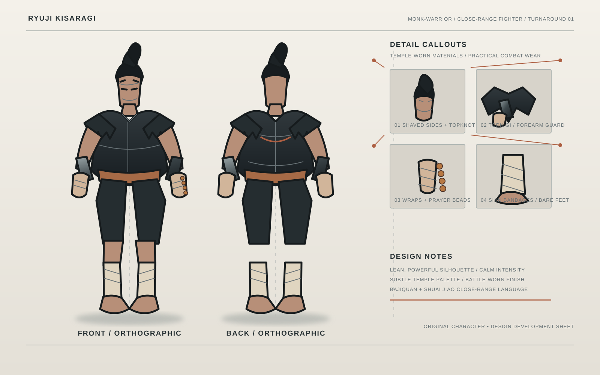

# Ryuji-Kisaragi
Hybrid of Bajiquan and Shuai Jiao, with grapples, explosive elbows, and short-range power strikes

## Character sheet

The turnaround presents Ryuji in front and back orthographic views, with callouts for his topknot, torn sleeveless gi, prayer beads, wrapped hands, metallic forearm guards, bandaged shins, and bare feet.
